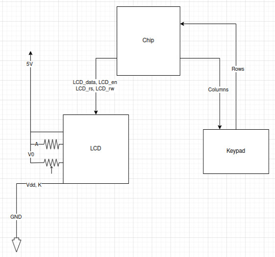
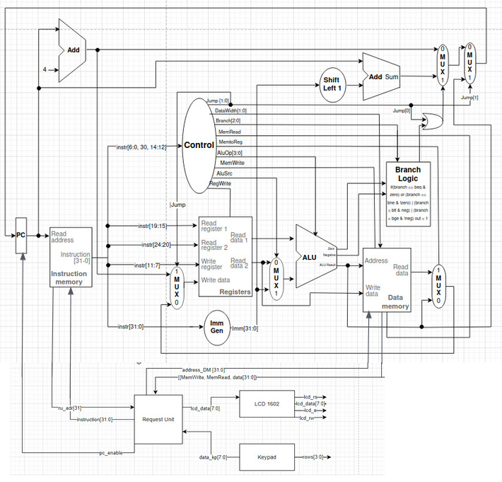
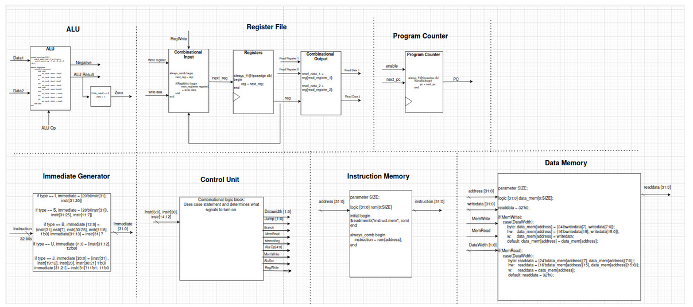
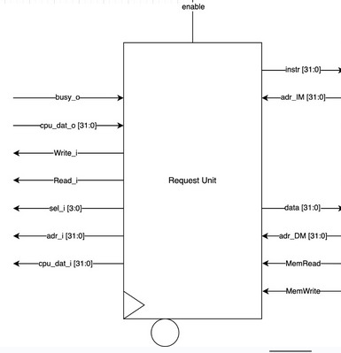
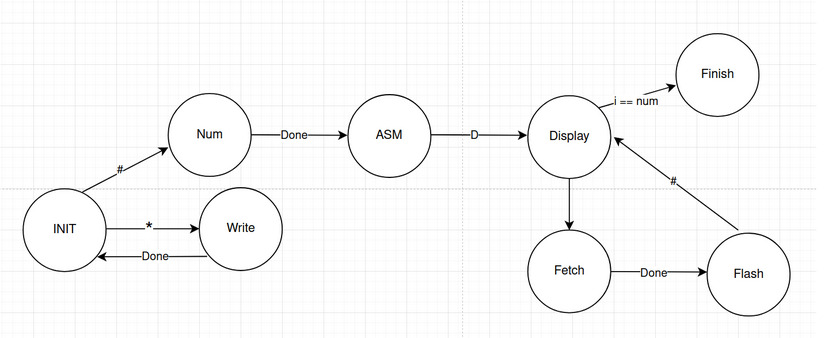

# STARS 2024 Design Final Project

## TEAM NAME
* Team Member 1 Santiago Pineiros
* Team Member 2 Andrew Bauer
* Team Member 3 Ivan Usynin
* Team Member 4 Johnny Hazboun
* Peer Mentor Pranav Sangam

## Project Type
Short (2-3 sentences) Team 01’s final project for the Summer 2024 STARS program consisted of the design of a 32 bit single cycle CPU with the RISC-V instruction set architecture. The final CPU supports a total of 40 instructions containing all the classical arithmetic, logical, jump, and branch instruction types. 

## Pin Layout
Note that on the final chip, there are 38 gpio of which you have access to 4.
The first number represents the GPIO on the physical board. The second number
in brackets represents the number in your verilog code

00[00] Input/Output: 
01[--] Input/Output: 
02[--] Input/Output: 
03[--] Input/Output: 
04[--] Input/Output: 
05[01] Output: LCD_en
06[02] Output: LCD_rs
07[03] Output: LCD_rw
08[04] Output: LCD_data
09[05] Output: LCD_data
10[06] Output: LCD_data
11[07] Output: LCD_data
12[08] Output: LCD_data
13[09] Output: LCD_data
14[10] Output: LCD_data
15[11] Output: LCD_data
16[12] Input: KP_rows
17[13] Input: KP_rows
18[14] Input: KP_rows
19[15] Input: KP_rows
20[16] Output: KP_cols 
21[17] Output: KP_cols 
22[18] Output: KP_cols 
23[19] Output: KP_cols 
24[20] Input/Output:  
25[21] Input/Output:  
26[22] Input/Output:  
27[23] Input/Output:  
28[24] Input/Output:  
29[25] Input/Output: 
30[26] Input/Output: 
31[27] Input/Output: 
32[28] Input/Output: 
33[29] Input/Output: 
34[30] Input/Output: 
35[31] Input/Output: 
36[32] Input/Output: 
37[33] Input/Output: 
38[34] Input/Output: 

## Supporting Equipment
List all the required equipment and upload a breadboard with the equipment set up (recommend using tinkercad circuits if possible)

-10K (Ohms) potentiometer
-150 (Ohms) Resistor
-Keypad Digikey Part Number: 1528-2672-ND
-LCD Digikey Part Number: 3647-LCD16022x16Green-Yellow-ND 
## RTL Diagrams
All the stuff from the proposal goes here, obviously updated from the time you did the proposal to the final layout
Include more than just block diagrams, including sub-block diagrams, state-transition diagrams, flowcharts, and timing diagrams.  If you include an image, a short (0.5-1 sentence description) is required.
You may also place other files within this folder.

## Statement from Purdue
Pending

